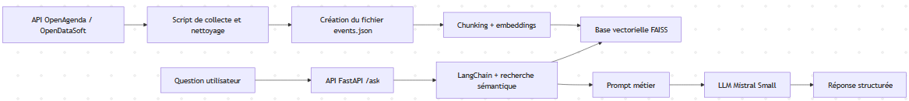

# Assistant intelligent de recommandation d’événements culturels

Projet de type POC RAG pour recommander des événements culturels locaux à partir de données OpenAgenda, avec génération de réponses en langage naturel et exposition via une API FastAPI.

## 1. Objectifs du projet

### Contexte
La mission du projet consiste à concevoir un assistant capable de répondre à des questions comme « quels événements culturels sont disponibles à Valenciennes ce mois-ci ? » en s’appuyant sur des données publiques et sur un moteur de recherche sémantique.

### Problématique
Un système RAG répond bien au besoin métier car il combine :
- une base documentaire actualisable à partir d’une source externe,
- une recherche sémantique sur les événements pertinents,
- une génération contrôlée de réponse, sans inventer d’événements.

Le besoin métier n’est donc pas seulement de « chatter », mais de retrouver rapidement des événements pertinents selon un lieu, une période et parfois un thème.

### Objectif du POC
Ce POC vise à démontrer :
- la faisabilité technique d’un assistant de recommandation d’événements,
- la valeur métier d’une réponse contextualisée et filtrée,
- la capacité à construire et interroger un index vectoriel localement,
- la robustesse minimale via des tests automatiques.

### Périmètre
- Zone géographique : Valenciennes, département du Nord.
- Période de collecte : événements compris entre mars 2025 et mars 2027 dans le pipeline de production actuel.
- Données utilisées : API publique OpenAgenda via OpenDataSoft.

## 2. Architecture du système

### Schéma global




### Données entrantes
- Source principale : API `https://public.opendatasoft.com/api/records/1.0/search/`.
- Filtrage appliqué :
	- `dataset = evenements-publics-openagenda`
	- `refine.location_city = Valenciennes`
	- `refine.location_department = Nord`

### Prétraitement / embeddings / base vectorielle
- Les événements sont normalisés dans un format exploitable pour le RAG.
- Le texte de chaque événement est transformé en document vectorisable.
- Les documents sont découpés en chunks avant l’indexation.
- Les embeddings sont calculés avec `all-MiniLM-L6-v2`.
- Les vecteurs sont stockés dans FAISS sous `data/faiss_index`.

### Intégration LLM avec LangChain
- La récupération des documents est faite avec LangChain.
- Le modèle de génération est Mistral, appelé via le SDK `mistralai`.
- Le prompt métier impose de rester strictement sur le contexte récupéré.

### Exposition via API
- L’API est exposée avec FastAPI.
- Le point d’entrée principal est `app/api.py`.
- Les endpoints publics permettent la question utilisateur et le contrôle de santé.
- L’endpoint protégé `/rebuild` relance la reconstruction de la base de connaissances.

### Technologies utilisées
- Python 3.12
- FastAPI
- LangChain
- FAISS
- HuggingFace Sentence Transformers
- Mistral via `mistralai`
- Requests
- Pydantic
- Uvicorn
- Les tests sont des scripts Python autonomes, pas une suite Pytest classique

## 3. Préparation et vectorisation des données

### Source de données
Le pipeline de production s’appuie sur `scripts/fetch_data.py`.

Paramètres utilisés :
- `DATASET = evenements-publics-openagenda`
- `CITY_FILTER = Valenciennes`
- `DEPARTMENT_FILTER = Nord`
- `DATE_FROM = 2025-03-01`
- `DATE_TO = 2027-03-31`

Le script pagine sur l’API jusqu’à ce qu’aucun enregistrement supplémentaire ne soit renvoyé.

### Nettoyage
Les traitements réalisés sont les suivants :
- suppression des balises HTML dans les descriptions,
- gestion des valeurs absentes,
- conversion des dates en format `YYYY-MM-DD`,
- harmonisation des champs `title`, `description`, `city`, `department`, `tags`.

Dans le code actuel, certaines anomalies simples sont corrigées par normalisation plutôt que par une logique lourde de correction.

### Chunking
Le chunking est réalisé avec `RecursiveCharacterTextSplitter`.

Paramètres :
- `chunk_size = 500`
- `chunk_overlap = 50`

Ce découpage permet de conserver un contexte compact tout en limitant la perte d’information lors de la recherche sémantique.

### Embedding
- Modèle utilisé : `all-MiniLM-L6-v2`
- Sortie : vecteurs de dimension 384
- Logique : chaque chunk est converti en embedding puis indexé dans FAISS
- Format : textes et métadonnées associées pour chaque chunk

## 4. Choix du modèle NLP

### Modèle sélectionné
Le modèle de génération utilisé est `mistral-small-latest`.

### Pourquoi ce modèle ?
Ce choix est cohérent avec un POC pour plusieurs raisons :
- bon compromis entre qualité de génération et coût,
- compatibilité directe avec le SDK `mistralai`,
- intégration simple dans le pipeline LangChain / prompt métier,
- réponse suffisamment stable pour du classement d’événements.

### Prompting
Le prompt est construit dans `app/prompt.py`.

Il impose notamment :
- de n’utiliser que les événements présents dans le contexte,
- de ne jamais inventer de dates ou d’événements,
- de privilégier le thème, la période et le lieu si la question le demande,
- de répondre en format lisible avec nom, date, lieu et description.

### Limites du modèle
- Le modèle dépend fortement de la qualité des documents récupérés.
- Il reste sensible aux formulations ambiguës.
- Sans garde-fou, il peut répondre de manière trop négative malgré un contexte pertinent, d’où la deuxième passe de correction dans `app/rag.py`.

## 5. Construction de la base vectorielle

### FAISS utilisé
FAISS sert de base vectorielle locale pour stocker et interroger les embeddings.

### Stratégie de persistance
- Le code sauvegarde l’index dans `data/faiss_index`.
- Le fichier principal d’index est `index.faiss`.
- La base est rechargée au démarrage du module RAG.

### Format de sauvegarde
La persistance repose sur la méthode `save_local` de FAISS.

### Nommage
- Entrée structurée : `data/events.json`
- Index vectoriel : `data/faiss_index`
- Fichier brut de collecte : `events_vector_ready.json` dans certains scripts/prototypes

### Métadonnées associées
Chaque document conserve au minimum :
- `title`
- `description`
- `city`
- `date_start`
- `date_end`
- `tags`

Ces métadonnées sont utilisées pour le filtrage par date, thème et déduplication.

## 6. API et endpoints exposés

### Framework utilisé
FastAPI.

### Endpoints clés

#### `GET /`
Vérifie que l’API répond.

Réponse :
```json
{"status": "ok"}
```

#### `POST /ask`
Envoie une question utilisateur au système RAG.

Exemple de corps :
```json
{
	"question": "Donne moi un événement d'escrime en septembre 2025"
}
```

Réponse attendue :
```json
{
	"question": "Donne moi un événement d'escrime en septembre 2025",
	"answer": "..."
}
```

#### `POST /rebuild`
Reconstruction complète de la base de connaissances.

Protection : Basic Auth via `REBUILD_USER` et `REBUILD_PASSWORD`.

### Format des requêtes/réponses
- Requête `POST /ask` : JSON avec le champ `question`.
- Réponse : JSON avec reprise de la question et texte de réponse du modèle.

### Exemple d’appel API

```bash
curl -X POST "http://127.0.0.1:8000/ask" ^
	-H "Content-Type: application/json" ^
	-d "{\"question\": \"Donne moi un événement de musique en 2026\"}"
```

### Tests effectués et documentés
Des scripts de validation sont présents dans `test/` :
- vérification de l’API,
- vérification du chargement des données et de l’index FAISS,
- vérification des règles métier du RAG,
- vérification de métriques de performance,
- évaluation simple sur un jeu de questions annotées.

### Gestion des erreurs / limitations
- Absence de clé Mistral : `app/rag.py` lève une erreur explicite.
- Si l’index FAISS ou `events.json` est absent, les scripts de test échouent immédiatement.
- L’endpoint `/rebuild` renvoie une erreur si une étape de reconstruction échoue.

## 7. Évaluation du système

### Jeu de test annoté
Le fichier `test/test_questions.json` contient un petit jeu de validation manuelle.

### Nombre d’exemples
4 exemples sont présents dans l’état actuel du dépôt.

### Méthode d’annotation
Le script `test/evaluate_rag.py` compare une réponse attendue à la réponse produite et classe le résultat en :
- correcte,
- partiellement correcte,
- incorrecte.

### Métriques d’évaluation
Les indicateurs effectivement mesurés dans le dépôt sont :
- taux de réponses correctes,
- taux de réponses partiellement correctes,
- taux de réponses incorrectes.

### Résultats obtenus
Sur le jeu de test fourni dans `test/rag_evaluation_results.json` :
- 3 réponses correctes sur 4,
- 0 partiellement correcte,
- 1 incorrecte.

Soit un taux de réponses correctes de 75 % sur ce mini-jeu.

### Analyse qualitative
- Bon fonctionnement sur les requêtes de type thème + période.
- Bonne capacité à retourner plusieurs événements pertinents.
- Cas plus fragile dès que la question est trop large ou trop éloignée du périmètre des données.

## 8. Recommandations et perspectives

### Ce qui fonctionne bien
- Pipeline clair de bout en bout : collecte, indexation, recherche, génération.
- Réponses généralement pertinentes quand la question est bien cadrée.
- Tests déjà présents pour l’API, les règles métier et l’index.

### Limites du POC
- Volumétrie limitée au périmètre de Valenciennes et du Nord.
- Dépendance à la qualité des données OpenAgenda.
- Coût et latence dépendants de l’appel au LLM distant.
- Jeu d’évaluation encore trop petit pour conclure statistiquement.

### Améliorations possibles
- Ajouter un vrai jeu de test plus large et mieux annoté.
- Mettre en place un monitoring des temps de réponse et des erreurs API.
- Externaliser la configuration dans des variables d’environnement documentées.
- Ajouter une version Docker reproductible.
- Améliorer le reranking des documents avant génération.

### Passage en production
Un passage en production pourrait s’appuyer sur :
- conteneurisation Docker,
- supervision des appels API,
- cache local de l’index,
- gestion centralisée des secrets,
- CI/CD avec exécution des scripts de test.

## 9. Organisation du dépôt GitHub

### Arborescence du dépôt

```text
Projet07/
├── app/
│   ├── api.py
│   ├── prompt.py
│   └── rag.py
├── data/
│   ├── events.json
│   └── faiss_index/
├── main.py
├── scripts/
│   ├── build_index.py
│   └── fetch_data.py
├── test/
│   ├── evaluate_rag.py
│   ├── rag_evaluation_results.json
│   ├── run_all_tests.py
│   ├── test_api_endpoints.py
│   ├── test_data_indexing.py
│   ├── test_performance_metrics.py
│   ├── test_questions.json
│   └── test_rag_unit_rules.py
├── pyproject.toml
└── README.md
```

### Rôle des répertoires
- `app/` : logique métier du RAG, prompt et API.
- `scripts/` : génération des données et construction de l’index.
- `data/` : données d’entrée et index vectoriel persistant.
- `test/` : scripts de validation et d’évaluation.
- `main.py` : script autonome de prototype / export, distinct du flux API principal.

## 10. Annexes

### Extrait du jeu de test annoté
Exemple de question du fichier de test :
- « Donne moi un événement d'escrime en septembre 2025 »

### Prompt utilisé
Le prompt métier est défini dans `app/prompt.py` et demande au modèle de :
- rester strictement dans le contexte,
- ne rien inventer,
- formater la réponse de façon structurée.

### Extrait de réponse JSON
Exemple de réponse de l’API :
```json
{
	"question": "Donne moi un événement d'escrime en septembre 2025",
	"answer": "Nom : Escrime\nDate : 2025-09-21\nLieu : Valenciennes (Nord)\nDescription : ..."
}
```

## Installation et lancement

### Prérequis
- Python 3.12
- Une clé API Mistral dans un fichier `.env` à la racine du projet

Variables attendues :
- `MISTRAL_API_KEY`
- éventuellement `REBUILD_USER` et `REBUILD_PASSWORD`

### Mise à jour des données
```bash
python scripts/fetch_data.py
python scripts/build_index.py
```

### Lancement de l’API
```bash
uvicorn app.api:app --reload
```

### Lancement des tests
```bash
python test/run_all_tests.py
```

## Remarque
Le dépôt contient aussi un ancien script de collecte dans `main.py`. Le flux actuellement utilisé par l’API repose sur `scripts/fetch_data.py` et `scripts/build_index.py`.
